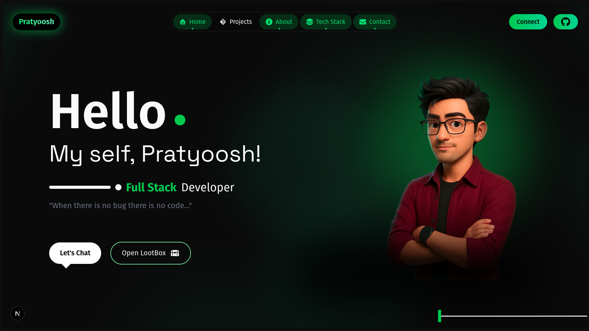

# 🌐 Pratyoosh.dev — My Portfolio Website

>Welcome to the source code of **[pratyoosh.me](https://pratyoosh.me)** — my personal developer portfolio.  
>It’s a mix of professionalism, clean design, and a bit of humor (because who wants boring portfolios, right?).

---

## ✨ Features

- **About Me** – A quick look at who I am (spoiler: I break Linux, fight with DSA, and build SaaS projects).  
- **Timeline** – My journey from C/C++ and DSA → Full-Stack Dev → AI/ML adventures.  
- **Projects Showcase** – Highlighting my favorite builds and experiments.  
- **Contact Section** – Easy ways to reach me.  
- **Responsive Design** – Looks great on desktop, tablet, and mobile.  

---

## 🛠️ Tech Stack

- **Framework:** [Next.js](https://nextjs.org/)  
- **Frontend:** TypeScript, React, TailwindCSS  
- **Backend / ORM:** Prisma (for future DB-driven features)  
- **Deployment:** Vercel  

---

## 🚀 Roadmap

- ✅ Core portfolio (About, Timeline, Projects, Contact)  
- 🔜 **Blog Page** – A space where I’ll share thoughts, tech experiments, and random rants (Coming in Future).  
- 🔮 Future ideas: Interactive terminal mode, dark/light themes, maybe even easter eggs 👀  

---

## 📸 Preview

  

---

## 📬 Contact

If you’d like to connect, feel free to reach out:  

- GitHub: [@rlpratyoosh](https://github.com/rlpratyoosh)  
- LinkedIn: [rlpratyoosh](https://linkedin.com/in/rlpratyoosh)  
- Email: pratyoosh.prakash.dev@gmail.com  

---

## ⚡ License

This project is open source under the MIT License.  

---

> “Turning caffeine and code into SaaS ideas since 2025 ☕💻”
